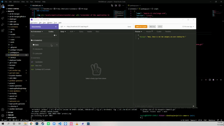

___

# SQL: CRUD and E-Commerce
## Description

This was a project to build the back end for an e-commerce site, using the Express.js API and Sequelize to interact with the MySQL database.

I used three Node Package Modules: [MySQL2](https://www.npmjs.com/package/mysql2), [Sequelize](https://www.npmjs.com/package/sequelize), and [dotenv package](https://www.npmjs.com/package/dotenv).


## Table of Contents 

* [License](#license)
* [Installation](#installation)
* [Usage](#usage)
* [Credits](#credits)


## License

[](https://opensource.org/licenses/GPL-2.0)

## Installation 

First star it. 
Then you could either fork it or download a zip file of it.

You should also have Node and MySQL installed to your machine.

Then hit ```npm i``` to install all of the packages included in the package.json file.

## Usage

**All of the details for npm shortcuts were stored in the package.json**

Replace with your own info in the config/connection.js

Login into MySQL and the ```use ecommerce_db``` and then ```show tables``` ton confirm it worked.

```npm run seed``` to set up some starter data for your base.

```npm start``` will run the application.

## Credits

My cohort's TA, **Leticia**, helped me in getting my TABLES up and running, and my tutor, **Ben Abbot**, helped me get my files all set up.


## How You Can Contribute

If you find issues open up an issues on the original repo! Fix it or add to it, then make a pull request.

## How You Can Reach Me

If you'd like to ask further questions you can reach me via [GitHub](https://github.com/cat-lin-morgan/) or email me at plummorgan@gmail.com!

## Screenshot and Video Walk-Thru

### Video Walk-thru
[Click here for the walk-thru of my application.](https://drive.google.com/file/d/1MLdQwBLWbQ3hCKZAh-YngstWyhU1FcYV/view)

### Screenshot




___Thank you___

___


